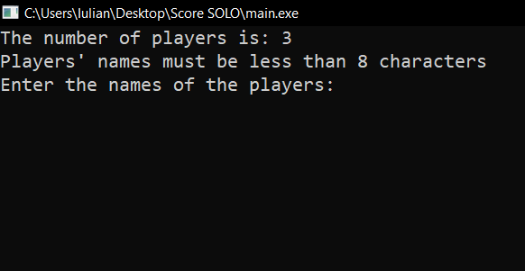
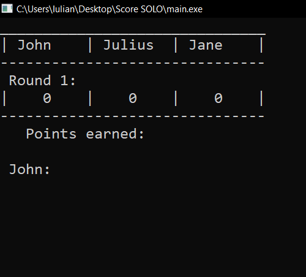
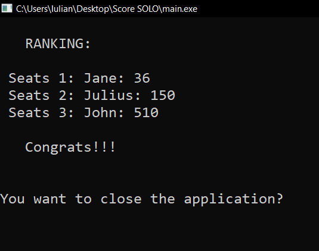

# SOLO_score

---

You know the card game named Solo, well for me and my family was hard to note and calc the score after the games, so i decide to make a program that will help me with that

---
## First step

You have to select how many players, and type their name

---
## Second step

After every round you type how many point every player has in hand

---
## Final step

When a player reach the number of points where he lose, the game stops and show the ranking

